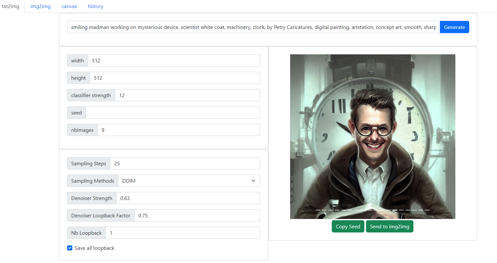
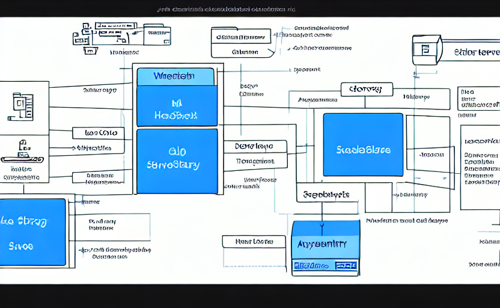

# stable diffusion my UI

flask (backend python) + svelte (frontend javascipr)

it take a lot of code and inspiration from the hlky fork https://github.com/sd-webui/stable-diffusion-webui

but I was sick of working with gradio

## Backend

- install the original https://github.com/CompVis/stable-diffusion
- activate it in anaconda
- install the missing stuff via pip (flask, flask_cors, perhaps some other stuff)

## Front end

- go in 'ui/'
- do 'npm install'
- do 'npm run dev'

## !!! Work in progress !!!

this stuff broke all the time, I'm tinkering

## Architecture diagram

because I know you'll like some explanation

