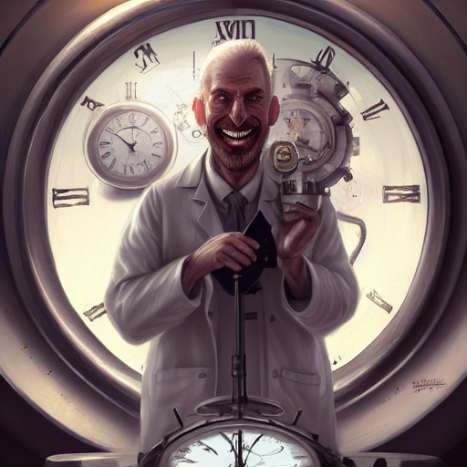

# stable diffusion my UI

flask (backend python) + svelte (frontend javascript)

it take a lot of code and inspiration from:
- the auto1111 fork https://github.com/AUTOMATIC1111/stable-diffusion-webui
- the hlky fork https://github.com/sd-webui/stable-diffusion-webui

but I was sick of working with gradio, also take a bit of pieces from other repo I forgot... look at my Frankenstein's Monster:

no not the picture above, but the code in this repo !

## Backend

- install the original https://github.com/CompVis/stable-diffusion
- activate it in anaconda
- install the missing stuff via pip (flask, flask_cors, perhaps some other stuff)
- create `repositories` directory with the following repo inside:
- stable-diffusion: https://github.com/CompVis/stable-diffusion
- taming-transformers: https://github.com/CompVis/taming-transformers
- CodeFormer: https://github.com/sczhou/CodeFormer
- BLIP: https://github.com/salesforce/BLIP
- once everything is installed you can launch with `sd-croq.cmd` or `python main.py`

## Front end

- go in 'ui/'
- do 'npm install'
- do 'npm run dev'

## !!! Work in progress !!!

this stuff broke all the time, I'm tinkering

## Tabulation

- txt2img: you enter a prompt (with all the power of Automatic1111: negative, weighted, etc...)
- img2img: you enter a prompt and an image
- canvas: it's a bit a wild experimental place here, don't go inside this madness
- lab: fix faces, upscale, img2txt
- history: save your favorites creation and all their parameters

## Architecture diagram

because I know you'll like some explanations

## Reddit

follow me on reddit for incredibles images ! https://www.reddit.com/user/croquelois/